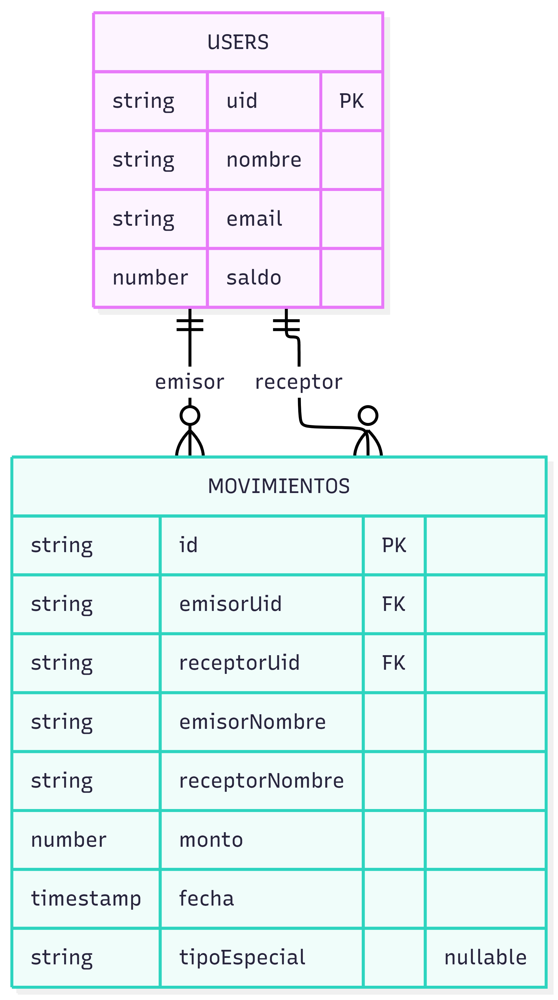
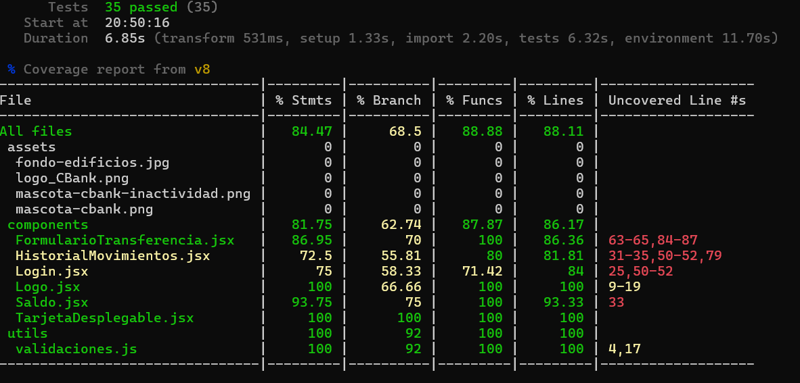

# CBank — Mini Banco Digital

Aplicación de banca digital simulada, desarrollada con React y Firebase. Implementa autenticación, saldo en tiempo real, transferencias entre usuarios, historial de movimientos y depósito/retiro simulado.

> ⚠️ Este es un proyecto académico con fines educativos. No constituye una institución financiera real ni ofrece servicios bancarios legítimos.

## Stack

- React 18 + Vite
- Firebase Authentication (correo/contraseña)
- Cloud Firestore
- CSS puro (sin frameworks de estilos)

## Requisitos previos

- Node.js 18 o superior
- Una cuenta de Firebase (gratuita) para crear tu propio proyecto de Authentication + Firestore

## Instalación y ejecución en local

1. Clona el repositorio:
```bash
   git clone https://github.com/CristobalContreras-lml/CBank.git
   cd CBank
```

2. Instala las dependencias:
```bash
   npm install
```

3. Crea tu propio proyecto en [Firebase Console](https://console.firebase.google.com):
   - Habilita **Authentication** → método "Correo electrónico/contraseña"
   - Habilita **Firestore Database**
   - Aplica las reglas de seguridad incluidas en `firestore.rules`
   - Registra una app web y copia sus credenciales

4. Copia `.env.example` a `.env` y completa con tus credenciales de Firebase:
```bash
   cp .env.example .env
```

5. Ejecuta el proyecto:
```bash
   npm run dev
```

6. Abre `http://localhost:5173` en tu navegador.

## Usuarios de prueba

| Nombre | Email | Contraseña |
|---|---|---|
| Demo Uno | demo1@cbank.cl | Demo1234 |
| Demo Dos | demo2@cbank.cl | Demo1234 |

Ambas cuentas parten con un saldo inicial de $100.000, y ya tienen movimientos previos entre ellas para probar el historial.

## Modelo de datos

<p align="center">
  
</p>

**Diferencias respecto al modelo base sugerido, y por qué:**

- **Se agregaron `emisorNombre` y `receptorNombre`** (denormalización): permite mostrar "Enviaste a Felipe" en el historial sin hacer una consulta adicional a `users/{uid}` por cada movimiento. Mejora la eficiencia de lectura a costa de una pequeña duplicación de datos — un trade-off estándar en bases de datos NoSQL.
- **Se agregó `tipoEspecial`**: permite diferenciar un depósito/retiro (donde `emisorUid === receptorUid`, ya que la operación es sobre la misma cuenta) de una transferencia real entre dos personas distintas. Necesario para el bonus de depósito/retiro simulado.
- **No se implementó el campo `descripcion`** del modelo sugerido: ningún formulario de la app lo solicita al usuario; quedó fuera del alcance.

El historial se arma combinando **dos suscripciones `onSnapshot`** en tiempo real (una por `emisorUid == uid`, otra por `receptorUid == uid`), deduplicadas con un `Map` para evitar mostrar dos veces un depósito/retiro (que matchea ambas condiciones a la vez).

## Reglas de seguridad

Las reglas de Firestore están documentadas en `firestore.rules`, en la raíz del proyecto. Resumen:
- Solo usuarios autenticados pueden leer/escribir.
- Un usuario solo puede crear su propio documento en `users`.
- Los movimientos son inmutables una vez creados (no se pueden editar ni borrar).
- Solo el emisor declarado puede crear un movimiento donde figura como tal.

**Limitación conocida:** validar que el monto descontado al emisor coincide exactamente con el abonado al receptor requeriría Cloud Functions (lógica de servidor con privilegios de administrador), fuera del alcance de esta evaluación. Las reglas actuales permiten que cualquier usuario autenticado actualice el campo `saldo` de otro usuario — mitigado en la práctica porque toda escritura pasa por `runTransaction` en el cliente, pero no está garantizado a nivel de reglas.

## Funcionalidades implementadas

- **RF1** — Registro, login y logout con Firebase Authentication
- **RF2** — Dashboard con saldo en tiempo real (`onSnapshot`)
- **RF3** — Transferencias entre usuarios con transacción atómica (`runTransaction`)
- **RF4** — Historial de movimientos en tiempo real, con filtro por tipo y búsqueda por nombre
- **RF5** — Logout con cancelación automática de suscripciones activas

### Bonus implementados

- Depósito y retiro simulado, con límite de $5.000.000 por operación (requiere autorización de un ejecutivo sobre ese monto, simulando una política AML real)
- Filtro y búsqueda en el historial de movimientos
- Estado global de sesión con `useReducer` + `useContext`
- Identidad visual propia (logo, mascota, tarjeta bancaria animada, tipografía Fraunces + Inter)
- Modo oscuro persistente (guardado en `localStorage`, respeta la preferencia del sistema operativo por defecto)
- Cierre de sesión automático tras 3 minutos de inactividad

## Arquitectura del proyecto

src/
├── firebase/         → configuración e inicialización de Firebase
├── services/         → toda la lógica de Firestore/Auth (los componentes nunca importan Firebase directo)
├── context/           → estado global (sesión, tema visual)
├── components/       → componentes de UI, cada uno con una sola responsabilidad
└── App.jsx           → enrutamiento simple entre Login/Registro/Dashboard

La separación entre `components/` y `services/` permite que la lógica de negocio (transacciones, suscripciones) sea independiente de la interfaz — un componente solo llama funciones como `transferir(emisorUid, receptorUid, monto)` sin saber que por dentro eso ejecuta una transacción atómica en Firestore.

## Uso de IA

Este proyecto se desarrolló con la asistencia de Claude (Anthropic) como tutor de programación, en un proceso guiado paso a paso: cada archivo se explicó antes de escribirse (por qué esa estructura, por qué esas dependencias de `useEffect`, por qué una transacción atómica y no escrituras sueltas), y cada avance se probó en el navegador antes de continuar al siguiente paso. La IA no generó el proyecto de una sola vez; el desarrollo fue incremental, con debugging real de errores propios (configuración de `.env`, reglas de Firestore, errores de sintaxis) resueltos en el camino. Puedo explicar y justificar cada decisión técnica del código, incluyendo por qué ciertos `useEffect` tienen las dependencias que tienen y qué pasaría si se omitiera la limpieza de suscripciones.


---

## 🧪 Testing (Evaluación 2)


### Stack de testing

- **Vitest** como test runner (nativo de Vite)
- **@testing-library/react** + **@testing-library/user-event** — interacción y queries por accesibilidad
- **@testing-library/jest-dom** — matchers extra (`toBeInTheDocument`, `toBeDisabled`, etc.)
- **jsdom** — entorno de navegador simulado
- **@vitest/coverage-v8** — reporte de cobertura

### Ejecutar los tests

```bash
npm test
```

Corre toda la suite una vez y termina (no queda en modo watch).

```bash
npm run coverage
```

Corre la suite y genera además el reporte de cobertura de líneas/branches/funciones.

### Qué se refactorizó para hacer el código testeable

- **Validaciones extraídas a `src/utils/validaciones.js`**: la lógica de "monto válido", "email válido" y "reglas de transferencia" vivía mezclada dentro del `handleTransferSubmit` de `FormularioTransferencia.jsx`. Se extrajo a funciones puras (`esEmailValido`, `esMontoValido`, `validarTransferencia`) que no dependen de React ni de Firebase, lo que permite testearlas de forma aislada y exhaustiva sin necesidad de renderizar ningún componente.
- **`FormularioTransferencia.jsx` se actualizó** para usar `validarTransferencia(...)` en vez de repetir las validaciones inline, y se agregó una suscripción a `observarSaldo` dentro del propio componente (antes solo se validaba el saldo dentro de la transacción atómica) — esto permitió testear el caso "monto mayor al saldo disponible → rechazado" como parte de la función pura.

### Resumen del reporte de cobertura

35 tests, 6 archivos de test, todos en verde.

<p align="center">
  
</p>

Todos los archivos exigidos por la rúbrica (RT2, RT3, RT4) superan el mínimo de 70% de cobertura de líneas: `validaciones.js` (100%), `FormularioTransferencia.jsx` (86.36%), `Login.jsx` (84%), `HistorialMovimientos.jsx` (81.81%). La cobertura de branches es más baja en general porque no se persiguió cubrir cada combinación posible de condiciones — la rúbrica exige cubrir bien lo crítico, no el 100% del proyecto.

Quedaron deliberadamente fuera del alcance de esta evaluación (0% o sin tests directos): `App.jsx`, `DepositoRetiro.jsx`, los archivos de `src/services/` y `src/context/`, y los assets estáticos (imágenes) — ninguno de estos está pedido explícitamente por RT2-RT4.

### Bonus implementados

- **Test de `unsubscribe` al desmontar** (`Saldo.test.jsx`): verifica que la función de limpieza del `useEffect` se ejecuta al desmontar el componente, y que al cambiar el `uid` se cancela la suscripción anterior antes de crear una nueva.
- **GitHub Actions**: workflow en `.github/workflows/tests.yml` que corre `npm test` en cada `push` a `main`, sobre una máquina virtual limpia (confirma que el proyecto funciona con solo `package.json`, no solo en el entorno local).
- **Tests parametrizados con `it.each`**: usados en `validaciones.test.js` para la batería de casos de `esMontoValido`.

### Uso de IA para los tests

Se usó Claude como asistente para diseñar la estructura de tests (AAA, mocks, casos borde) y explicar el porqué de cada decisión antes de escribirla. Varios tests generados inicialmente fallaron y se corrigieron con causas reales, no triviales:

- **Query ambigua en `FormularioTransferencia.test.jsx`**: el primer intento usaba `getByRole("button", { name: /transferir/i })`, que hacía match con dos botones distintos (el header colapsable "Transferir dinero" y el botón de submit "Transferir"), porque la regex sin anclas coincidía con cualquier texto que *contuviera* la palabra. Se corrigió a `/^transferir$/i` para exigir coincidencia exacta.
- **Mock de historial sin ordenar**: un test de `HistorialMovimientos.test.jsx` asumía que el componente ordenaba los movimientos por fecha, y fallaba porque esa lógica en realidad vive en `historialService.js` (el componente solo renderiza lo que recibe). Se corrigió el mock para que entregue los datos ya ordenados, imitando fielmente el contrato real del servicio.
- **Interacción entre validaciones**: un test que esperaba el error de "límite de operación" ($5.000.000) recibía en cambio el error de "saldo insuficiente", porque el saldo mockeado por defecto ($100.000) era menor al monto de prueba. Se corrigió mockeando un saldo suficientemente alto para aislar específicamente la validación de límite.

